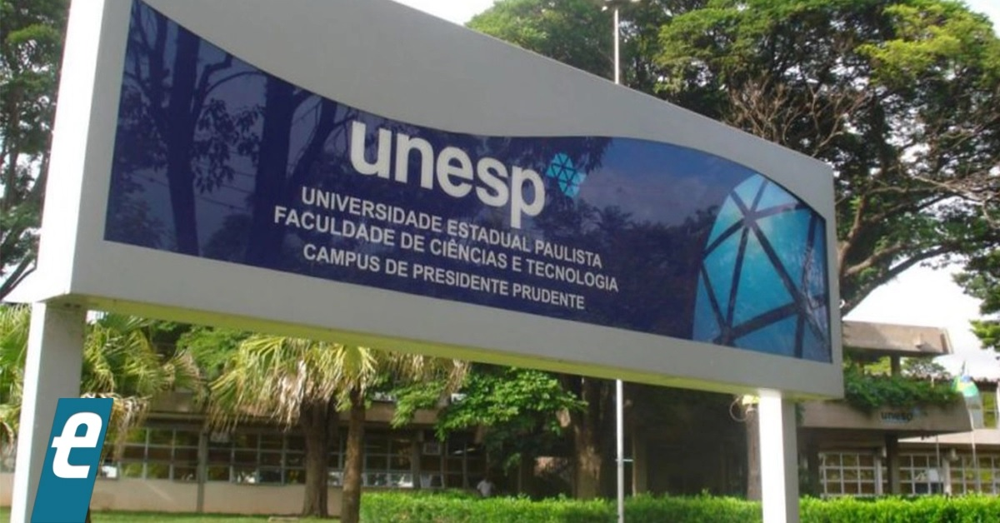

## 🎓 Formação 

<br>

✅ Ensino básico

::: {.fragment}
- 🏫 EMEIF Álvares Machado <br>
:::

<br>

::: {.fragment}
- 🏫 EE Profa. Angélica de Oliveira
:::

<br>

---

✅ Bacharel em Estatística

{fig-align="center" width="35%"}

::: {.fragment}
✅ Mestrado e Doutorado em Ciências

{fig-align="center" width="40%"}
:::

## 🧐 Área de pesquisa 

<br>

:::{.columns}
:::{.column width="60%"}

::: {.fragment}
✅ Análise de sobrevivência
:::

<br>

::: {.fragment}
✅ Estatística experimental
:::

<br>

::: {.fragment}
✅ Modelos de regressão
:::

<br>

::: {.fragment}
✅ Controle estatístico do processo
:::

:::

:::{.column width="40%"}

<br>

<iframe src="https://giphy.com/embed/3orieUe6ejxSFxYCXe" width="345" height="260" style="" frameBorder="0" class="giphy-embed" allowFullScreen></iframe><p><a href="https://giphy.com/gifs/season-16-the-simpsons-16x3-3orieUe6ejxSFxYCXe"></a></p>

:::
:::

## 🏫 Universidades 

<br>

:::{.columns}
:::{.column width="50%"}

:::{.fragment}
{fig-align="center" width="50%"}
:::

<br>

:::{.fragment}
{fig-align="center" width="50%"}
:::

:::

:::{.column width="50%"}

:::{.fragment}
{fig-align="center" width="50%"}
:::

<br>

<iframe src="https://giphy.com/embed/nCVVpakhBTwBi" width="350" height="195" style="" frameBorder="0" class="giphy-embed" allowFullScreen></iframe><p><a href="https://giphy.com/gifs/work-late-nCVVpakhBTwBi"></a></p>

:::
:::

## Apresentar-se

<br>

- Nome

- Cidade de origem

- Está fazendo estágio ou IC ou extensão? Se sim, em qual área

{fig-align="right" width=35% height=35%}

## 🎯 Objetivo da disciplina 

<br>

::: {.callout-note}
- Resolver problemas estatísticos aplicados, requisitados pela comunidade, com redação de relatórios técnicos;

- Encontrar soluções estatísticas de forma independente diante de situações práticas.
:::

## ⏰ Horário

<br>

Aulas

- Terça-feira das 7:30 ~ 11:10   

## 📚 Bibliografias 

<br>

```{r , echo=FALSE, fig.align = 'center', out.width = '10%'}
knitr::include_graphics('https://media.giphy.com/media/v1.Y2lkPTc5MGI3NjExNzV2aTBhZHIxajA1ZHhmOTlvbTVoMGR1YWczdjFycTZ0MDlqeXc0eCZlcD12MV9naWZzX3NlYXJjaCZjdD1n/sD3aa6UiynWfFZJX6E/giphy.gif')
```

## &#128105;&#8205;&#127979; Aulas

<br>

:::{.fragment}
- duas terças-feiras para apresentação de trabalho
:::

:::{.fragment}
- demais dias, estarei tanto em sala presencial quanto em sala virtual tirando dúvidas
:::

{fig-align="right" width="35%" height="35%"}

## 🧑‍💻🧑‍💻 Trabalhos em grupo

**Formação dos grupos**

- ~~Cinco~~ <span style="color: red;">Quatro</span> grupos no total.

- Quatro grupos com ~~quatro~~ <span style="color: red;">cinco</span> alunos.

- ~~Um grupo com três alunos~~.

:::{.fragment}
**Plano de execução**

- Elaborar o plano de execução seguindo o template disponibilizado.

- Definir de forma objetiva o que será feito em cada dia da semana.

- Utilizar linguagem clara e objetiva.
:::

---

**Apresentação**

- Apresentar o trabalho para a turma.

- Tempo máximo: ~~15~~ <span style="color: red;">25</span> minutos por grupo.

- Arguição: ~~10~~ <span style="color: red;">15</span> minutos.

- Organizar a apresentação de forma clara, objetiva e didática.

- Opte por uma vestimenta que transmita seriedade e confiança.

:::{.fragment}
**Relatório final**

- Elaborar o relatório conforme o template disponibilizado.

- Apresentar os resultados e as principais conclusões do trabalho.

- Utilizar linguagem clara, objetiva e organizada.
:::

## 🎯Construção de dashbord

<div style="text-align: center;">
<iframe 
  src="https://www.hypar.com.br/"
  width="90%"
  height="420"
  style="border: none;">
</iframe>
</div>

:::{.justificado}
**Desafio**: Desenvolver um *dashboard* para uma loja de ferramentas, permitindo ao proprietário acompanhar e analisar o desempenho das vendas e dos produtos.
:::

## 🎯Problema de usinagem

<br>

<!--
:::{.fragment}
**Objetivo**: Simular diferentes cenários de vida útil de uma mola remanufaturada e avaliar seu potencial de redução da pegada de carbono (CO₂e) ao longo da vida útil de um caminhão.
:::

::: {.fragment}

**Dados de referência**

- Vida útil do caminhão: 1.000.000 km

- Vida útil média de uma mola nova: 300.000 km

- Vida útil da mola remanufaturada: fixe três porcentagens da vida útil de uma mola nova.
:::

---

**Desafio**: simular os dados de pegada de carbono para comparar a vida útil da mola remanufaturada.
-->

**Desafio**: utilizar dados experimentais para ranquear, com rigor estatístico, os fluidos testados com base nas variáveis observadas.

```{r , echo=FALSE, fig.align = 'center', out.width = '40%'}
knitr::include_graphics('https://media.giphy.com/media/v1.Y2lkPTc5MGI3NjExMTJkZXJ2dzRxd21ydDRtaXNpd3JnejBxZ3g1ZXF4YWQzNGQwdDJlaiZlcD12MV9naWZzX3NlYXJjaCZjdD1n/4EFt4pA9U27Gau23IZ/giphy.gif')
```

## 📝 Avaliações dos trabalhos 

:::{.justificado}
Haverá duas apresentações de trabalhos. As apresentações deverão estar bem organizadas. As ideias, escolhas e resultados apresentados deverão ser claramente explicados. Vocês deverão demonstrar não apenas o domínio do conteúdo, mas também a capacidade de comunicar suas ideias.
:::

:::{.columns}
:::{.column width="50%"}
- Apresentação 1

**20/10/2026**
:::

:::{.column width="50%"}
- Apresentação 2

**15/12/2026**
:::
:::


## 🔢 Critério de avaliação

Resolução 106/2012, 23/2013 e 75/2016:

:::{.justificado}
&#10004; Será aprovado o aluno que obtiver média final (MF) maior ou igual a 5 $(MF\geq5)$, em que
		$$MF=(N_1+N_2)/2,$$
em que
$$N_i=P+A+C,\quad i =1, 2,$$
em que $P$ é a nota do plano de execução (máximo de um ponto), $A$ é nota da apresentação (máximo de quatro pontos) e $C$ é a avaliação do cliente (máximo de cinco pontos). 
:::

<br>

:::{.justificado}
&#10004; Para $MF$ poderá ser acrescentado um bônus por engajamento.
:::

---

:::{.justificado}

&#10004; O aluno com $MF<5$ deverá reapresentar o trabalho no dia 19-01-2027.

Então,
$$MFr=\frac{MF+NE}{2},$$ 
em que $NE$ é a nota do exame final.

Dessa forma, $$NF=\min(5,MFr).$$
Será aprovado o aluno com $NF\geq5$.
:::

## 🚫 Desonestidade acadêmica

{fig-align="center" width="40%"}

A desonestidade em nosso trabalho representa uma **grave violação ética**.

## International Data Quest 🌍

<br>

Competição internacional de dados organizado pelo [*Committee on International Relations in Statistics*](https://community.amstat.org/committeeoninternationalrelationsinstatistics/events2/data-quest)

<br>

👩‍🎓 Quem pode participar?

➡️ **Público-alvo**: estudantes de graduação e mestrado (em qualquer área!).

➡️ **Equipes**: de 2 a 4 participantes (somente graduação ou somente mestrado).

---

➡️ **Países participantes na 1ª edição**: Brasil, Indonésia e Turquia.

➡️ **Competição em duas fases**: nacional e internacional.

<br>

:::{.fragment}
🏆 Prêmios:

1. Best Data Visualization

2. Best Consideration of Ethics

3. Best Statistical Insight
:::

---

📅 Datas importantes:

🔹 **Divulgação dos dados**: 6 de outubro

🔹 **Registro de equipes**: até 18 de outubro (aconselhamos até 11 de outubro)

🔹 **Submissões (vídeo + slides)**: até 25 de outubro

---


<br>

:::{.columns}
:::{.column width="60%"}

&#10004; <https://moodle.unesp.br/>

<br>

&#10004; Graduação - busca: 2026 laboratório

<br>

&#10004; 2026 - Laboratório de Estatítsica

<br>

&#10004; Senha: lab
:::

:::{.column width="40%"}
```{r , echo=FALSE, fig.align = 'left', out.width = '80%'}
knitr::include_graphics('https://media.giphy.com/media/IoP0PvbbSWGAM/giphy.gif')
```
:::
